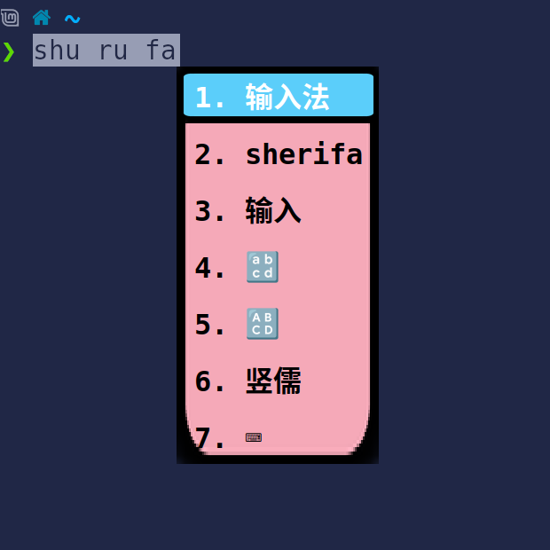
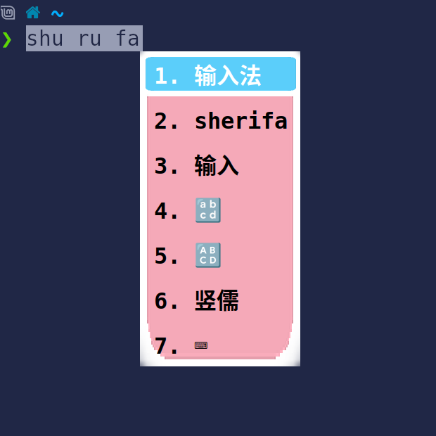
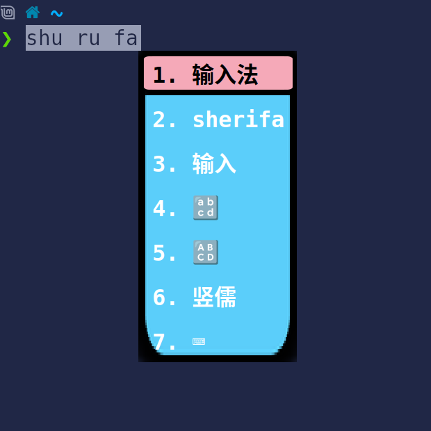
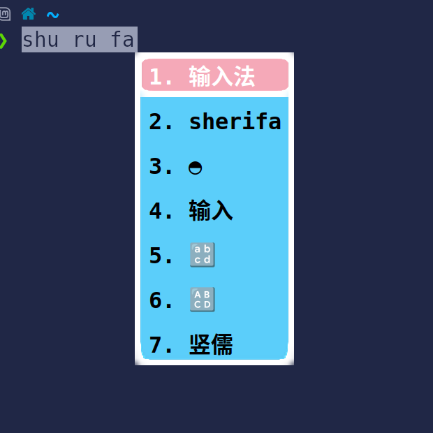

# Fcitx5 蓝粉白主题

一款为 Fcitx5 输入法框架设计的蓝粉白主题

## 主题配色

本主题使用的主体颜色：

| 颜色 | 色值 | 用途 |
|------|------|------|
| 浅蓝 | `#5BCEFA` | 高亮背景、菜单高亮 |
| 浅粉 | `#F5A9B8` | 菜单背景 |
| 白色 | `#FFFFFF` | 边框、分隔线 |

## 主题变体

本项目包含 4 个主题变体，满足不同使用场景和个人偏好：

### 1. transgender-png（标准版）



- 黑色文字，浅蓝高亮
- 蓝粉白配色面板
- 适合浅色桌面环境

### 2. transgender-white-png（白色边框版）



- 在标准版基础上添加白色边框
- 更清晰的视觉层次

### 3. transgender-inverted-png（反转版）



- 白色文字，深色背景
- 蓝粉白反转配色
- 适合深色桌面环境

### 4. transgender-inverted-white-png（反转白色边框版）



- 反转配色 + 白色边框
- 深色环境下的精致风格

## 安装方法

### 方法一：手动安装（推荐）

1. **克隆仓库**
   ```bash
   git clone https://github.com/Caoxiaocao/fcitx5-theme-transgender.git
   cd fcitx5-theme-transgender
   ```

2. **复制主题文件到 Fcitx5 主题目录**
   ```bash
   # 用户级安装（推荐）
   mkdir -p ~/.local/share/fcitx5/themes/
   cp -r transgender-png ~/.local/share/fcitx5/themes/
   cp -r transgender-white-png ~/.local/share/fcitx5/themes/
   cp -r transgender-inverted-png ~/.local/share/fcitx5/themes/
   cp -r transgender-inverted-white-png ~/.local/share/fcitx5/themes/
   ```

   或者系统级安装：
   ```bash
   # 系统级安装（需要 root 权限）
   sudo cp -r transgender-png /usr/share/fcitx5/themes/
   sudo cp -r transgender-white-png /usr/share/fcitx5/themes/
   sudo cp -r transgender-inverted-png /usr/share/fcitx5/themes/
   sudo cp -r transgender-inverted-white-png /usr/share/fcitx5/themes/
   ```

3. **重启 Fcitx5**
   ```bash
   # 重启 Fcitx5 服务
   fcitx5 -r
   
   # 或者完全退出后重新启动
   fcitx5 -d
   ```

### 方法二：使用安装脚本

```bash
git clone https://github.com/Caoxiaocao/fcitx5-theme-transgender.git
cd fcitx5-theme-transgender
chmod +x install.sh
./install.sh
```

## 启用主题

安装完成后，需要在 Fcitx5 配置中启用主题：

### 图形界面方式
1. 打开 **Fcitx5 配置**（`fcitx5-configtool`）
2. 进入 **附加组件** 选项卡
3. 找到 **经典用户界面** 或 **Kimpanel**（根据你使用的界面）
4. 在 **主题** 下拉菜单中选择：
   - `transgender-png`（标准版）
   - `transgender-white-png`（白色边框版）
   - `transgender-inverted-png`（反转版）
   - `transgender-inverted-white-png`（反转白色边框版）
5. 点击 **应用** 或 **确定**

### 命令行方式
编辑 Fcitx5 配置文件：
```bash
# 编辑配置文件
nano ~/.config/fcitx5/conf/classicui.conf
```

添加或修改以下行：
```
# 使用标准版
Theme=transgender-png

# 或使用白色边框版
# Theme=transgender-white-png

# 或使用反转版
# Theme=transgender-inverted-png

# 或使用反转白色边框版
# Theme=transgender-inverted-white-png
```

保存后重启 Fcitx5：
```bash
fcitx5 -r
```

## 卸载主题

```bash
# 删除用户级安装的主题
rm -rf ~/.local/share/fcitx5/themes/transgender-png
rm -rf ~/.local/share/fcitx5/themes/transgender-white-png
rm -rf ~/.local/share/fcitx5/themes/transgender-inverted-png
rm -rf ~/.local/share/fcitx5/themes/transgender-inverted-white-png

# 或删除系统级安装的主题
sudo rm -rf /usr/share/fcitx5/themes/transgender-png
sudo rm -rf /usr/share/fcitx5/themes/transgender-white-png
sudo rm -rf /usr/share/fcitx5/themes/transgender-inverted-png
sudo rm -rf /usr/share/fcitx5/themes/transgender-inverted-white-png

# 重启 Fcitx5
fcitx5 -r
```


## 主题特性

- ✅ 支持 HiDPI 显示（`ScaleWithDPI=True`）
- ✅ 支持 KWin 窗口模糊效果（`EnableBlur=True`）
- ✅ 完整的菜单样式配置
- ✅ 清晰的文字对比度
- ✅ 响应式边距设计

## 兼容性

- **Fcitx5 版本**：5.0+
- **桌面环境**：KDE Plasma、GNOME、Xfce、LXQt 等
- **显示服务器**：X11、Wayland

## 致谢


## 许可证

本项目采用 [MIT 许可证](LICENSE) 开源。

## 贡献

欢迎提交 Issue 和 Pull Request！

如果你有新的主题变体想法或改进建议，请随时提出。

---

